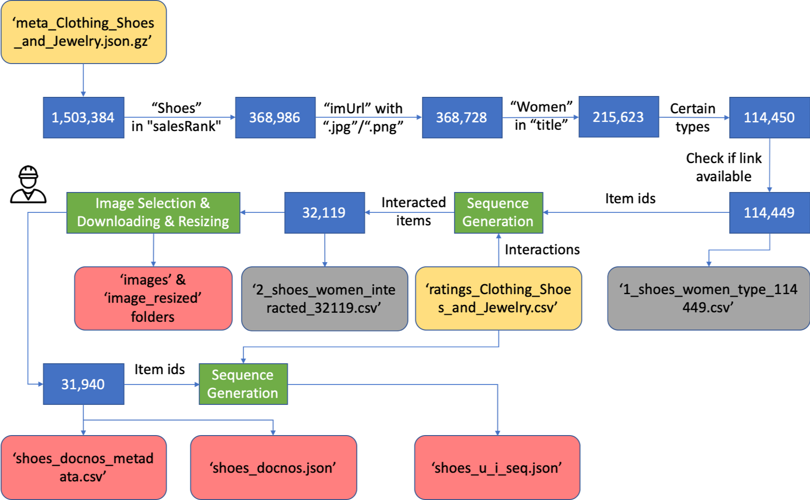
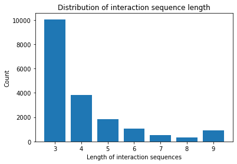
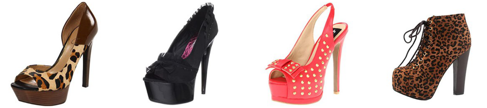
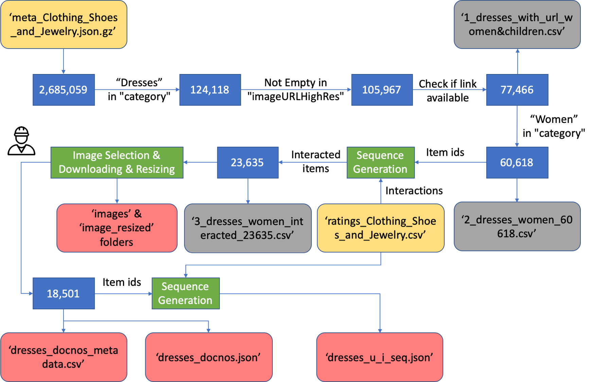
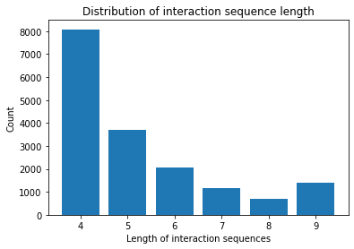
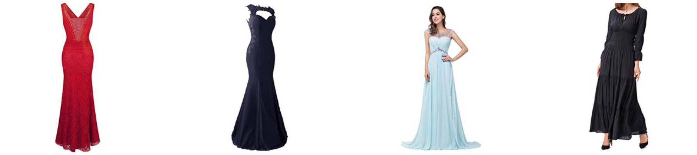
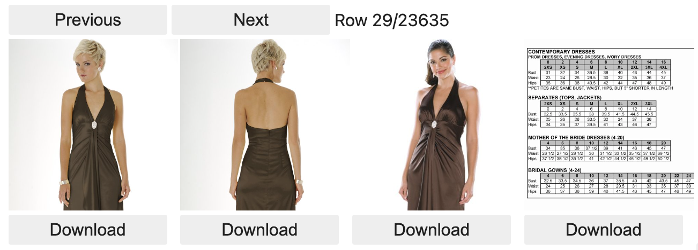
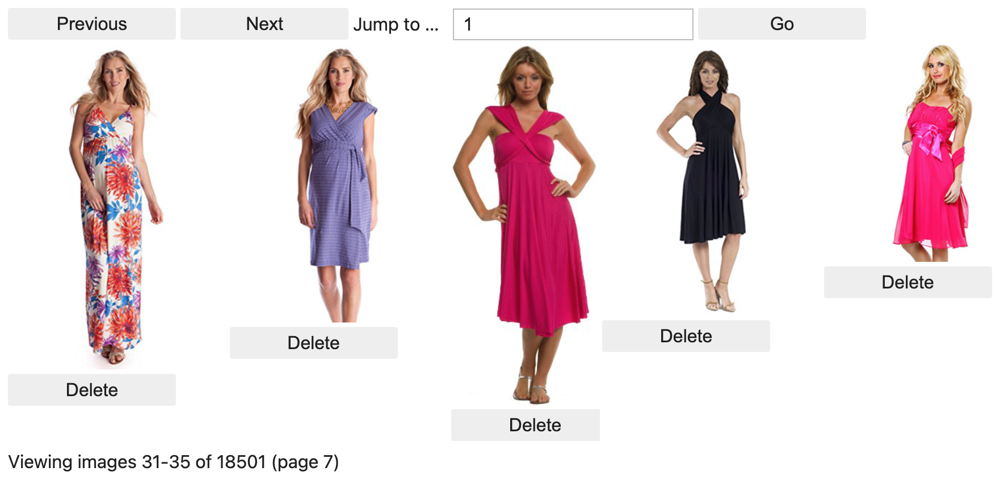
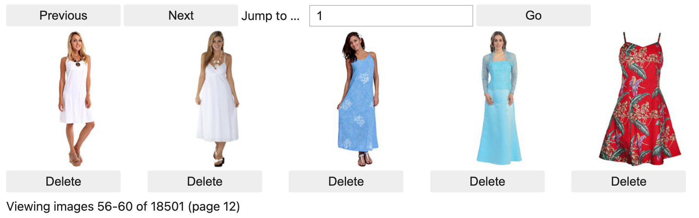

# pmmir
Personalised Multi-Modal Interactive Recommendation

## Datasets

Currently, we provide 2 datasets (Amazon-Shoes & Amazon-Dresses) for the multi-modal interactive recommendation task. Here we illustrate how to use the provided tools to generate and clearn the datasets.

### Amazon-Shoes

`Amazon-Shoes` dataset is derived from [Amazon review (2014)](http://jmcauley.ucsd.edu/data/amazon/links.html) with the `Clothing, Shoes and Jewelry` category. "Amazon review (2014)" dataset contains product reviews and metadata from Amazon, including 142.8 million reviews spanning May 1996 - July 2014.

Here, we provide a diagram to show how we get the interaction sequences and their corresponding images of shoes. In particular, we mainly consider some specific types of shoes `shoes_types = ["Athletic", "Boot", "Clog", "Flat", "Heel", "Pump", "Sneaker", "Stiletto", "Wedding"]` due to the constraints from the user simulators for the MMIR task. In this dataset, each item is provided with a single url link. So we can download all the available images first and then remove images with poor qualities (more details can be seen in the ipynb files).

Here, we show the distribution of the sequence lengths on the Amazon-Shoes dataset.

Here is an example interaction sequence of shoes with `['B0079UK36A', 'B002RT4PLC', 'B0081N5UQW', 'B009TFOU3U']`:

### Amazon-Dresses

`Amazon-Dresses` dataset is derived from [Amazon Review Data (2018)](https://nijianmo.github.io/amazon/index.html) with the `Clothing, Shoes and Jewelry` category. "Amazon Review Data (2018)" dataset is an updated version of the Amazon review dataset released in 2014.

Here, we provide a diagram to show how we get the interaction sequences and their corresponding images of dresses. In this dataset, each item is provided with a list of urls. Some provided url links are broken and the corresponding images are not available anymore. So we need to identify the items with accessed urls. Then we can select a proper image for each item.

Here, we show the distribution of the sequence lengths on the Amazon-Dresses dataset.

Here is an example interaction sequence of dresses with `['B01E6Y03TS', 'B01DBQBGPC', 'B01C8GEVIU', 'B012VN7416']`:

## Functions

### Select & Download

We provide a function to select/download the images interactively.

### Delete

We provide a function to delete the downloaded images interactively.

### Resize

We provide a function to resize the images with 256*256 pixels.

